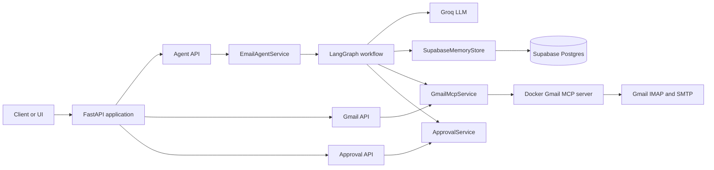
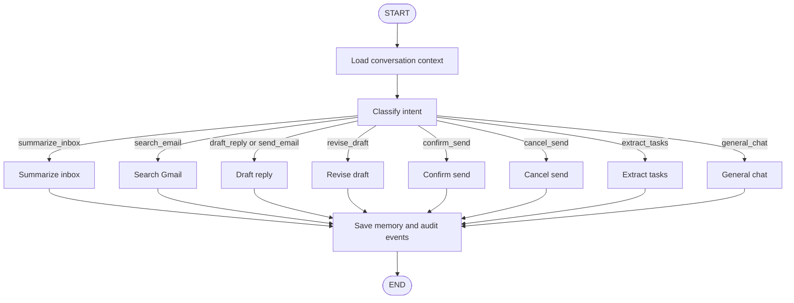
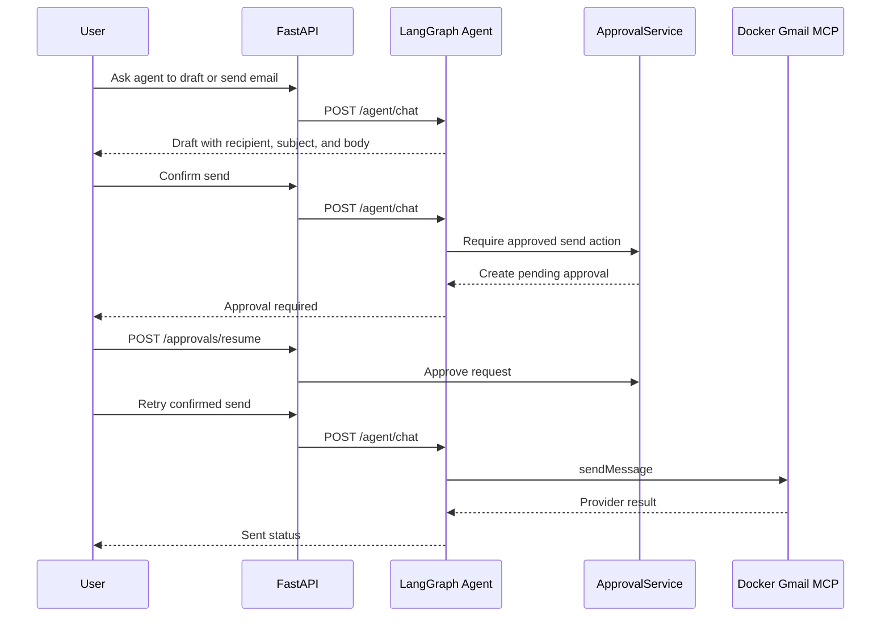

# Gmail AI Agent


A FastAPI service that exposes a session-aware Gmail assistant backed by LangGraph, Groq, Supabase memory, and the Docker Gmail MCP server.

The agent can summarize inbox messages, search Gmail, draft replies, revise drafts, extract tasks, and send email only after explicit approval. The Gmail integration is intentionally constrained to the validated Docker MCP tools: `listMessages`, `findMessage`, and `sendMessage`.

## Features

- Session-aware chat API for inbox workflows.
- LangGraph intent routing for summarize, search, draft, revise, confirm, cancel, task extraction, and general chat.
- Groq-backed LLM layer using an OpenAI-compatible API surface.
- Supabase persistence for conversation sessions, conversation messages, tool audit events, draft events, and send events.
- Docker Gmail MCP integration over IMAP/SMTP using a Gmail App Password.
- Human-in-the-loop approval gate before any email send operation.
- FastAPI routers for health, capabilities, agent chat, Gmail tools, and approvals.
- Pytest coverage for API, agent, Gmail MCP parsing, approvals, runtime config, and LangGraph Studio config.

## System Design



## Agent Workflow



## Send Approval Flow



## Tech Stack

| Layer | Technology |
| --- | --- |
| API | FastAPI, Uvicorn |
| Agent orchestration | LangGraph |
| LLM provider | Groq OpenAI-compatible API |
| Gmail integration | Docker Gmail MCP server, IMAP, SMTP |
| Memory and audit storage | Supabase Postgres |
| Workflow builder UI | Vite, React, React Flow |
| Settings | pydantic-settings, `.env` |
| Package management | uv |
| Tests | pytest, httpx |
| Runtime packaging | Docker, Docker Compose |

## Project Structure

```text
src/email_assistant_app/
  api/                 FastAPI routers
  agent/               LangGraph workflow, nodes, prompts, LLM adapter
  application/         Service layer and dependency factories
  domain/              Pydantic request/response models
  integrations/mcp/    Docker Gmail MCP client
  memory/              Supabase memory store
  observability/       Logging and request IDs
db/
  supabase_memory_schema.sql
tests/
  integration/
  unit/
  test_gmail_docker_mcp_tools.py
frontend/
  src/                 Local-only React Flow workflow builder shell
```

## Prerequisites

- Python 3.11 or newer.
- `uv` installed locally.
- Docker running locally.
- Node.js and npm for the optional workflow builder frontend.
- A Gmail account with IMAP enabled.
- A Gmail App Password. The normal Gmail password will not work.
- A Groq API key.
- A Supabase project with the memory schema applied.

## Configuration

Install dependencies and create a local environment file:

```bash
uv sync
cp .env.example .env
```

Configure `.env`:

```text
APP_NAME=email-assistant-app
ENVIRONMENT=local
LOG_LEVEL=INFO

GROQ_API_KEY=your_groq_api_key
GROQ_MODEL=openai/gpt-oss-120b
GROQ_BASE_URL=https://api.groq.com/openai/v1

SUPABASE_URL=https://your-project.supabase.co
SUPABASE_SERVICE_ROLE_KEY=your_server_side_service_role_key
SUPABASE_ANON_KEY=
DEFAULT_USER_ID=local-user

EMAIL_ADDRESS=your-email@gmail.com
EMAIL_PASSWORD=your_16_character_gmail_app_password
IMAP_HOST=imap.gmail.com
IMAP_PORT=993
SMTP_HOST=smtp.gmail.com
SMTP_PORT=587
GMAIL_MCP_IMAGE=yashtekwani/gmail-mcp
TEST_SEND_TO=your-email@gmail.com
```

Apply the Supabase schema in the Supabase SQL editor or through your migration workflow:

```text
db/supabase_memory_schema.sql
```

Pull the Gmail MCP image:

```bash
docker pull yashtekwani/gmail-mcp
```

## Run Locally

Start the API:

```bash
uv run uvicorn email_assistant_app.main:app --reload
```

Open the generated API docs:

```text
http://127.0.0.1:8000/docs
```

Or run with Docker Compose:

```bash
docker compose up --build
```

Run the local workflow builder frontend:

```bash
cd frontend
npm install
npm run dev
```

Open the Vite URL shown in the terminal. The workflow builder uses React Flow and `localStorage`, fetches approved node types from FastAPI when the backend is running, and can validate drafts through `POST /workflows/validate`. It does not execute workflows or expose Gmail MCP/internal tools from the browser.

Build the frontend:

```bash
cd frontend
npm run build
```

The Vite dev server proxies `/workflow-node-types` and `/workflows/*` to `http://127.0.0.1:8000`. Set `VITE_API_BASE_URL` if the FastAPI backend is served from a different origin. The backend does not save or execute workflows yet.

## API Reference

| Method | Path | Purpose |
| --- | --- | --- |
| `GET` | `/health` | Service health and environment |
| `GET` | `/capabilities` | Runtime feature and configuration status |
| `GET` | `/workflow-node-types` | List approved visual workflow builder node types |
| `POST` | `/workflows/validate` | Validate workflow JSON without saving or executing it |
| `POST` | `/agent/sessions` | Create a persisted agent conversation session |
| `GET` | `/agent/sessions` | List recent sessions for a user |
| `POST` | `/agent/chat` | Send one message through the email agent |
| `POST` | `/gmail/messages/list` | List recent Gmail messages through Docker MCP |
| `POST` | `/gmail/messages/search` | Search Gmail through Docker MCP |
| `POST` | `/gmail/messages/send` | Send email through Docker MCP after approval |
| `POST` | `/approvals/resume` | Approve or reject a pending action |

Create a session:

```bash
curl -X POST http://127.0.0.1:8000/agent/sessions \
  -H "content-type: application/json" \
  -d '{"user_id":"local-user","title":"Inbox triage"}'
```

Chat with the agent:

```bash
curl -X POST http://127.0.0.1:8000/agent/chat \
  -H "content-type: application/json" \
  -d '{
    "session_id": "SESSION_ID",
    "user_id": "local-user",
    "message": "Summarize my latest emails"
  }'
```

Search Gmail directly:

```bash
curl -X POST http://127.0.0.1:8000/gmail/messages/search \
  -H "content-type: application/json" \
  -d '{"query":"from:example@example.com newer_than:30d"}'
```

Request a send approval:

```bash
curl -X POST http://127.0.0.1:8000/gmail/messages/send \
  -H "content-type: application/json" \
  -d '{
    "to": "recipient@example.com",
    "subject": "Follow up",
    "body": "Thanks for the update."
  }'
```

Approve the pending action:

```bash
curl -X POST http://127.0.0.1:8000/approvals/resume \
  -H "content-type: application/json" \
  -d '{"approval_id":"APPROVAL_ID","approved":true}'
```

Retry the send with the approved ID:

```bash
curl -X POST http://127.0.0.1:8000/gmail/messages/send \
  -H "content-type: application/json" \
  -d '{
    "to": "recipient@example.com",
    "subject": "Follow up",
    "body": "Thanks for the update.",
    "approval_id": "APPROVAL_ID"
  }'
```

## Response Shape

`POST /agent/chat` returns:

```json
{
  "session_id": "SESSION_ID",
  "intent": "summarize_inbox",
  "message": "I found 10 recent emails...",
  "data": {
    "summary": {
      "items": [
        {
          "rank": 1,
          "message_id": "message-id",
          "thread_id": "thread-id",
          "sender": "Sender <sender@example.com>",
          "subject": "Subject",
          "date_utc": "2026-06-01T10:28:27Z",
          "snippet": "Short snippet",
          "main_point": "Main point",
          "action_required": "Review and respond if needed.",
          "urgency": "medium"
        }
      ],
      "notes": ["Only normalized message data is returned."]
    }
  },
  "pending_send": false,
  "draft": null
}
```

## Testing

Run the automated test suite:

```bash
uv run pytest
```

Run only the LangGraph Studio config tests:

```bash
uv run pytest tests/unit/agent/test_studio_graph.py -q
```

Run the standalone live Gmail MCP smoke test:

```bash
uv run python tests/test_gmail_docker_mcp_tools.py
```

The smoke test performs Docker and environment preflight checks, calls `listMessages`, `findMessage`, and `sendMessage`, sends a test email to `TEST_SEND_TO`, and writes `gmail_docker_mcp_test_report.md`.

Run the opt-in live Docker MCP integration test:

```bash
RUN_GMAIL_DOCKER_MCP_TESTS=true uv run pytest tests/integration/test_gmail_docker_mcp_connection.py -s
```

## LangGraph Studio

`langgraph.json` points to the real graph:

```json
{
  "$schema": "https://langgra.ph/schema.json",
  "dependencies": ["."],
  "graphs": {
    "email_agent_real": "./src/email_assistant_app/agent/studio/studio_graph_real.py:make_graph"
  },
  "env": ".env"
}
```

The fake Studio graph is still available in `src/email_assistant_app/agent/studio/studio_graph_fake.py` for local development and deterministic graph checks.

## Safety Model

- Email sends are approval-gated. A send without an approved `approval_id` creates a pending approval and does not call Gmail.
- The agent drafts first and waits for clear confirmation before sending.
- Gmail access uses a Gmail App Password through the Docker MCP container.
- `SUPABASE_SERVICE_ROLE_KEY` must remain server-side only.
- Conversation messages, tool summaries, draft events, and send audit events are persisted in Supabase.
- Approval state and transient follow-up state are process-local in this version; they reset when the API process restarts.

## Current Scope

Supported:

- Recent inbox summarization.
- Gmail search through `findMessage`.
- Reply drafting and draft revision.
- Explicit send confirmation and cancellation.
- Task extraction from email results.
- Direct Gmail list, search, and approved send endpoints.

Not included in this version:

- Google OAuth.
- Gmail label management.
- Gmail draft sync.
- Thread mutation, archive, delete, or label operations.
- Calendar integration.
- Multi-user OAuth account linking.
- Durable approval storage.

## Operational Notes

- Keep `.env` out of version control.
- Use `GET /capabilities` to confirm Groq, Supabase, and Gmail MCP configuration.
- Use `LOG_LEVEL=DEBUG` only for local troubleshooting.
- Rotate Gmail App Passwords and Supabase service role keys if they are exposed.
